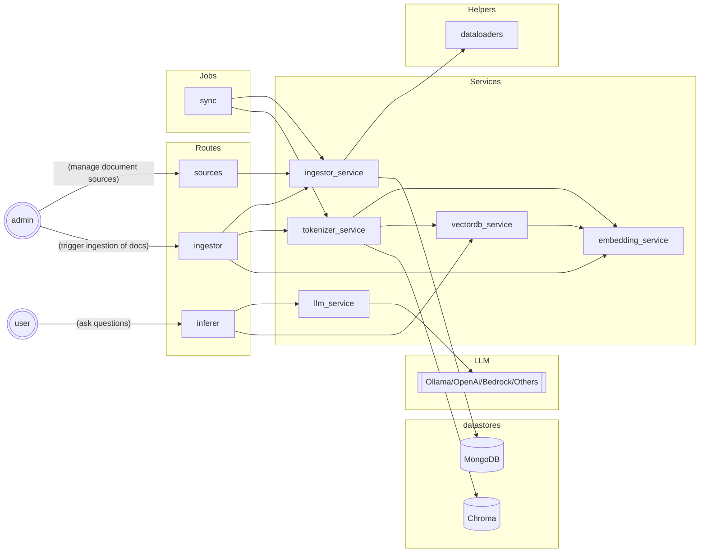

# About
NOTE: This PoC is work in progress.


This is a PoC for a RAG application that leverages a few langchain libraries. 
A langchain based version will be created separately. 
This is not a reference implementation for production use.


## Key Modules



## Setup Guide

(Work in progress)

Use virtual environment to download necessary files   
```bash
python -m venv ragapi
source ragapi/bin/activate
pip install 
```

To freeze and upgrade packages

```javascript
pip freeze > requirements.txt
pip install --upgrade -r requirements.txt
```

## Requirements 
- Install MongoDB (or configure access to a hosted service in config.py) 
- Install Ollama ( to use as local LLM ) 
- Pull a small model for testing (less accurate but good for CPU based machines). Configure it in config.py file.
- Install locally or have access to a MongoDB document store. It is used to pre-process documents and store cleaned versions.

```
ollama run llama3.1:8b
```

- Run Ollama (change model based on what you have pulled)

```
ollama run llama3.1
```

Ensure it is working by pasting http://localhost:11434/ in a browser window. You should see a message "Ollama is running" as response.


## Run service locally:

```
./run.sh
```

Ensure it is working by pasting http://localhost:8000/ in your browser and you should see a greeting json like this:
```
{
    "message": "Hello World"
}
```


### Invoke using following URLs

Ensure that copies of documents are saved under ./data/inp folder. Only PDF or DOCX format is supported but other format from the following list can be easily added: doc,ppt,pptx,csv,md,xlsx
Documents can be read from S3 or other cloud buckets too with additional code. 

API calls to test (there are no background jobs configured so trigger for ingestion is also an API endpoint)

- Ingest documents
http://localhost:8000/ingestor/ingest

- Tokenize
http://localhost:8000/ingestor/tokenize

- Ask questions. Get response as stream by setting stream=true. Default is false.
http://localhost:8000/inferer/search-similar?stream=<true|false>&q=<your question goes here?>
