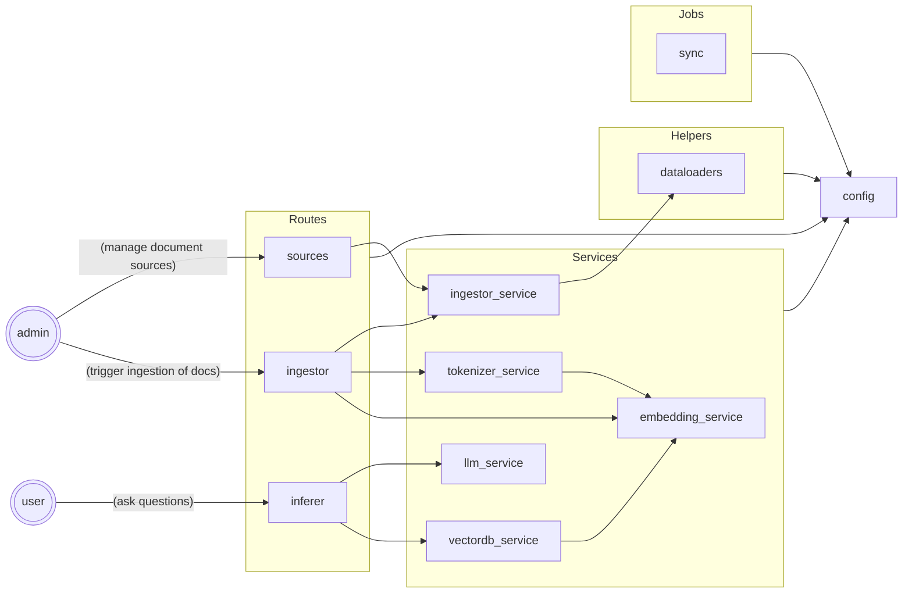

```mermaid
flowchart LR
    config

    admin(((admin)))
    admin--(manage document sources)-->sources
    admin--(trigger ingestion of docs)-->ingestor
    
    user(((user)))
    user--(ask questions)-->inferer
    sources-->ingestor_service

    ingestor-->ingestor_service
    ingestor-->tokenizer_service
    ingestor-->embedding_service
    
    inferer-->llm_service
    inferer-->vectordb_service
    
    tokenizer_service-->embedding_service
    vectordb_service-->embedding_service
    ingestor_service-->dataloaders
    
    subgraph Routes
        sources
        ingestor
        inferer
    end
    Routes-->config

    subgraph Services
        ingestor_service
        tokenizer_service
        embedding_service
        vectordb_service
        llm_service
    end
    Services-->config

    subgraph Helpers
        dataloaders
    end    
    Helpers-->config

    subgraph Jobs
        sync
    end
    Jobs-->config
```